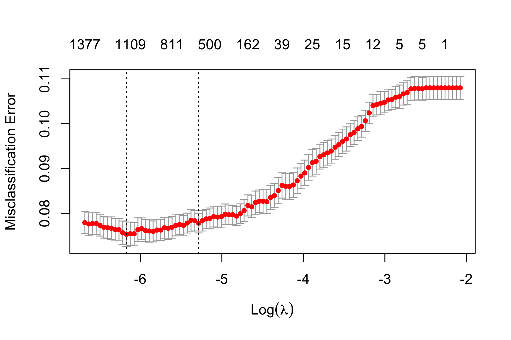

```{r setup, include=FALSE, message = FALSE}
options(scipen = 0, digits = 3)  # controls number of significant digits printed
library(tidyverse)
library(kableExtra)
```

\bigskip

The code to reproduce this report is available [on Github](https://github.com/rachelrwu99/NHAMCSexploration.git).

\newpage

# Executive Summary

**Problem.** With the exception of the hiatus during the peak of the COVID-pandemic, emergency departments in the United States have become increasingly crowded and play a central role in the healthcare of U.S. patients. Many patients use the emergency department as a substitute for primary care, especially patients without health insurance, and many patients show up to the department as a precaution, as many of us without medical training have a difficult time assessing the gray area between feeling ill and needing immediate medical attention. Due to a combination of these factors, emergency departments are congested and are often unable to meet the needs of the community. We explore the patient characteristics that affect the likelihood for a patient to be admitted to the hospital after presenting to the emergency department. With our exploration, we hope to elucidate the factors that contribute most to a patient’s chance of being admitted into the hospital, so patients might be able to better select the severity of their own condition and be more selective about visiting the emergency department. 

**Data.** Our data comes from the publicly available National Hospital Ambulatory Medical Care Survey (NHAMCS). It is compiled by the Centers for Disease Control and Prevention and a nationally representative survey of emergency departments in the United States when used with the weights included in the data set. However, we did not use the survey weights for our analysis. Each of the observations is a discrete patient visit to an emergency department. The features we use in our analysis are measurements taken upon entry to the emergency department and during the patient’s stay in the emergency department. We faced challenges with selecting variables, classifying categorical variables as factors, and dealing with missing data.

**Analysis.** 

**Conclusions.** 

# Introduction

**Background.** Coronavirus disease (COVID-19) has had a devastating global impact, with a cumulative total of 149,987,772 confirmed cases and 3,157,594 deaths worldwide as of April 28, 2021.^[Coronavirus Cases: Worldometer. (n.d.). https://www.worldometers.info/coronavirus/. 
] About a fifth of these cases have been in the United States, with a recent count of 32,551,440 cases and 582,668 deaths.^[Ibid.] With these staggering numbers still increasing despite recent large-scale vaccine rollouts, it is of vital importance to utilize various data sources to understand both the progression of COVID-19 thus far as well as the highest risk factors for contracting COVID-19. Furthermore, a thorough analysis of COVID-19 rates and predictive factors may help inform strategies to improve public health policies that could mitigate the negative impact of a future pandemic, which many scientists say is not a matter of if but of when.^[Robbins, J. (2021, January 4). Heading Off the Next Pandemic. Kaiser Health News. https://khn.org/news/infectious-disease-scientists-preventing-next-pandemic/. ]

Past research has shown that infectious diseases are influenced by a variety of factors. Obesity, for instance, is associated with a higher likelihood of contracting influenza A, and seasonal temperature changes have shown to be predictive of the 2003 severe acute respiratory syndrome (SARS).^[Tian, T., Zhang, J., Hu, L., Jiang, Y., Duan, C., Li, Z., ... & Zhang, H. (2021). Risk factors associated with mortality of COVID-19 in 3125 counties of the United States. Infectious diseases of poverty, 10(1), 1-8.] The CDC is currently in the process of identifying potential risk factors for severe COVID-19 illness,^[Centers for Disease Control and Prevention. (n.d.). Assessing Risk Factors for Severe COVID-19 Illness. Centers for Disease Control and Prevention. https://www.cdc.gov/coronavirus/2019-ncov/covid-data/investigations-discovery/assessing-risk-factors.html.] and some that have already been identified include heart disease, diabetes, and pregnancy.^[Centers for Disease Control and Prevention. (n.d.). Certain Medical Conditions and Risk for Severe COVID-19 Illness. Centers for Disease Control and Prevention. https://www.cdc.gov/coronavirus/2019-ncov/need-extra-precautions/people-with-medical-conditions.html.] Yet despite these efforts, there is still much to be learned. Specifically, there is still insufficient research to explain the differences in COVID-19 susceptibility and mortality that exist not just on the individual level but also on broader population levels. 

**Analysis goals.** As our analysis goal is to be able to return key factors that are most likely to predict a patient’s admission to the hospital or discharge from the emergency department, success is defined as consistent agreement among models as to the features that contribute to a hospital admission.

**Significance.** We hope that our analysis will contribute to the understanding of key drivers in healthcare management. Emergency departments are chronically overloaded and aiding the flow of patients in and out of the department through optimizing and anticipating a patient’s disposition will allow the emergency department to aid more patients. 

# Data

## Data sources

Our data came from the National Hospital Ambulatory Medical Care Survey (NHAMCS). NHAMCS is compiled by the CDC to “meet the need for objective, reliable information about the provision and use of ambulatory medical care services in the United States”, according to the NHAMCS home page, and is primarily used by researchers and policy makers. We uploaded the data from the CDC website and concatenated the datasets from years 2015-2019, inclusive. Although NHAMCS has been produced every year since 1992, the variables change from year to year and even with five years of data yielded management problems in regards to having to identify which columns were added or deleted between years. The 2019 data set is the most recent data set to date. Changes in emergency department management due to the COVID-19 pandemic are not reflected in our analysis.


## Data cleaning

After merging five datasets together, the main data cleaning task became researching and eliminating variables that were indicative of a patient’s disposition. It was important that we did not have any features that had a 1-to-1 correspondence with the response variable, ADMITHOS, a binary feature indicating whether the patient had been admitted to the emergency department’s hospital or not. Given that we were investigating the factors that contribute to a patient disposition of an “admit” to the hospital, many of the 1058 features had to be removed from the cleaned data set because they were taken after a disposition decision was made. 

Data cleaning also involved fixing the problem of copious missing data entries. NHAMCS changes the features collected from year to year, so there were some variables that were collected in 2015, but not in 2019, for example. Some features are impossible to impute, such as the prescription status codes or the controlled substance status codes, and have greater than 90% missing entries across all observations, such as the feature that records the code for the 20th prescription medication taken by the patient, since most patients do not ingest 20 pills on a daily basis. We removed those variables from our dataset and will speak to the limitations caused by the removal of variables in our conclusion. 

For features that included missing data but were numerical or were factorable, we calculated the means to impute data into the “blank” and “unknown” slots and turned the features with categorical responses into factors. Blank is coded as -9 in this dataset, so factored features have a level of -9. Finally, we removed any rows with NA values to allow our models to run smoothly.


## Data description

### Observations

Our dataset has a total of 935 observations, corresponding to each of the counties included in our analysis.

### Response Variable

Our response variable is the ADMITHOS feature, which is a categorical variable assigned a 1 if the patient was admitted to this hospital and 0 if they were not admitted. All datasets 2015-2019 included this feature. 

We have several similar features that tell us information on patient disposition (where a patient went after appearing at the emergency department). OBSHOS (indicating patients were admitted to the hospital after observation in the emergency department), TRANPYSC (patient transferred to a psychiatric hospital), and TRANOTH (patient was transferred to another hospital) were also variables that indicate the patient experienced additional care after being seen in the emergency department. However, we decided to focus only on ADMITHOS because of the clarity of the variable compared to the other potential response variables. TRANPYSC could indicate the patient went to a psychiatric hospital but may not have been admitted to that hospital; the same concern plagues the TRANOTH variable. OBSHOS is also binary and for every positive OBSHOS observed, there is also a positive ADMITHOS value for that given patient, so we eliminated OBSHOS as a feature so as to avoid a direct linear correspondence in our regression analysis.


### Features

We include 159 total features. For a detailed specification of these variables, refer to Appendix \@ref(appendix).

## Data allocation

After cleaning the data, we randomly selected 80% of our dataset into a training set and reserved the remaining 20% for our testing datasets.

## Data exploration

### Response

We first sought to understand the response variable’s distribution. As seen in the histogram of deaths variable (Figure \@ref(fig:response-histogram)), the data appears to be right-skewed, with some counties exceeding a death per cases rate of 0.1.  The median deaths per cases is 0.018. We proceeded to determine which counties had extreme response rates by looking at the sorted data. The sorted data (Table \@ref(tab:top-10-counties)) shows that aggregated across 2020, the highest rates of deaths per cases were primarily in northeastern states such as New York, New Jersey, and Connecticut.

```{r response-histogram, out.width = "80%", fig.cap = "Distribution of case-fatality rate; vertical dashed line indicates the median.", fig.align='center', echo = FALSE}
knitr::include_graphics("../results/response-histogram.png")
```

```{r top-10-counties, message = FALSE, echo = FALSE}
read_tsv("../results/top-10-counties-data.tsv") %>%
  kable(format = "latex", row.names = NA, 
        booktabs = TRUE, digits = 2, 
        col.names = c("County", "State", "Case-fatality rate"),
        caption = "Top ten counties by case-fatality rate 
        (expressed as a percentage).") %>%
  kable_styling(position = "center")
```

### Features

[Omitted from template.]

# Modeling

## Regression-based methods

### Ordinary least squares

[Omitted from template.]

### Penalized regression

Despite the ordinary least squares method seeming to work well, we realized that fitting a linear model with so many explanatory variables might incur a large cost in variance and lead to suboptimal predictions. Hence, we decided to build and evaluate shrinkage models with the hopes of getting a more parsimonious and interpretable model. We ran three cross-validated regressions for which optimal values of lambda were chosen according to the one-standard-error rule: ridge, LASSO (Least Absolute Shrinkage and Selection Operator), and elastic net. 

For the lasso, Figure \@ref(fig:lasso-CV-plot) shows the CV plot, Figure \@ref(fig:lasso-trace-plot) shows the trace plot, and Table \@ref(tab:lasso-coefficients) shows the selected features and their coefficients. 

[Interpretation of lasso omitted from this template. Other penalized regression methods omitted from this template.]


```{r lasso-CV-plot, out.width = "90%", fig.cap = "Lasso CV plot.", fig.align='center', echo = FALSE}

```

```{r lasso-trace-plot, out.width = "90%", fig.cap = "Lasso trace plot.", fig.align='center', echo = FALSE}

```

```{r lasso-coefficients, message = FALSE, echo = FALSE}
read_tsv("../results/lasso-features-table.tsv") %>%
  kable(format = "latex", row.names = NA, 
        booktabs = TRUE, digits = 2, 
        col.names = c("Feature", "Coefficient"),
        caption = "Standardized coefficients for features in the lasso 
        model based on the one-standard-error rule.") %>%
  kable_styling(position = "center")
```

## Tree-based methods

[Omitted from template.]

### Random forest

### Boosting

# Conclusions

## Method comparison

```{r model-evaluation, message = FALSE, echo = FALSE}
read_tsv("../results/model-evaluation.tsv") %>%
  kable(format = "latex", row.names = NA,
        booktabs = TRUE, digits = 2,
        caption = "Root-mean-squared prediction errors for lasso and ridge regressions.") %>%
  kable_styling(position = "center")
```

Table \@ref(tab:model-evaluation) shows the test RMSE for all the methods considered. Except for the OLS, the random forest and the boosted model have the lowest test errors. This is reasonable given these models’ tendencies to have high predictive accuracy. Between the two, the boosted model has the lowest test error, with a mean squared error of 0.000139, but it is closely followed by random forest, which has a mean squared error of 0.00141. Notably, however, the ridge, LASSO, and elastic net regressions perform about as well, with test MSEs of 0.000158, 0.000164, and 0.000161, respectively. Although OLS has the lowest training and test error, its adjusted R-squared value was only about 0.3, and there were too many features given the number of observations.

Regardless of these differences in test MSE, the methods overlap significantly in their identification of important variables from the larger set. For instance, the elastic net regression selects the following variables, which are also selected by LASSO and deemed significant in the OLS model: other providers ratio, unemployment, income inequality, housing overcrowding, residential segregation—non-White/White, homeownership, and physical inactivity. The random forest and boosting models both include low birthweight percentage, median income, and unemployment percentage in the top 10 most important variables, as measured by their contributions to node purity. 


## Takeaways


## Limitations

### Dataset limitations

NHAMCS changes the recorded variables every year, which makes it difficult to maintain consistency when concatenating five years of data. Additionally, looking at ADMITHOS as our response variable forced us to remove features that had a direct relationship with our response variable. For example, we removed any features that were measured at the time of discharge, since the presence of a value for these variables indicates that the patient is not being admitted to the hospital and is being released from the hospital. 

Missing data in general caused us to lose valuable observations, when we dropped the rows with NA values, and it also cost us valuable features, which had to be left out due to less than 90% of observations containing values for these particular features. We lost about 90% of our total data due to problems with missing data and also imputed means for some missing values, which increases bias and lowers the variance in our results.

Furthermore, this data set precedes the COVID-19 pandemic and does not illustrate any admission changes due to COVID. For example, it is likely that certain demographics sorted by age and race will be admitted to the hospital in the NHAMCS 2020 and 2021 datasets more frequently than in the 2015-2019 datasets, given the evidence that COVID fatalities were higher among populations of color and that one might reasonably presume that these populations would be visiting the hospitals more often due to COVID.


### Analysis limitations
We ran into difficulty with the random forests and boosting models. Some of our features included more than 1054 factors levels, features related to diagnosis codes or medicine names, and we were forced to exclude those variables from our training dataset. 
 

## Follow-ups


\appendix

# Appendix: Descriptions of features {#appendix}

Below are the 150 features we used for analysis. Words written in parentheses represent variable names. Unless noted otherwise, all variables are categorical. 

**Date of Visit**
  - Month of visit (`VMONTH`): 1-12, January-December
  - Day of the week (`VDAYR`): 1-7, Sunday-Saturday

**Patient's Reason for Visit**
  - Reason for visit #1 (`RFV1`): coded 1005.0-8999.0
  - Reason for visit #2 (`RFV2`): coded 1005.0-8999.0
  - Reason for visit #3 (`RFV3`): coded 1005.0-8999.0
  - Reason for visit #1 - broad (`RFV13D`): coded 0-1260
  - Reason for visit #2 - broad (`RFV23D`): coded 0-1260
  - Reason for visit #3 - broad (`RFV33D`): coded 0-1260
  

**Patient Medical History**
  - Alzheimer's/Dementia (`ALZHD`)
  - Asthma (`ASTHMA`)
  - Cancer (`CANCER`)
  - Cerebrovascular disease/History of stroke (`CEBVD`)
  - Chronic kidney disease (`CKD`)
  - Chronic obstructive pulmonary disease (`COPD`)
  - Congestive heart failure (`CHF`)
  - Coronary artery disease, ischemic heart disease, or hx of MI (`CAD`)
  - Depression (`DEPRN`)
  - Diabetes type 1 (`DIABTYP1`)
  - Diabetes type 2 (`DIABTYP2`)
  - Diabetes type unspecified (`DIABTYP0`)
  - Obesity (`OBESITY`)
  - Obstructive sleep apnea (`OSA`)
  - Osteoporosis (`OSTPRSIS`)
  - Substance dependence or abuse (`SUBSTAB`)
  
  - None of the above (`NOCHRON`)
  - Total number of chronic conditions (`TOTCHRON`): range 0-14


**Diagnostic Services:** 
  - Were diagnostic services provided at this visit? (`DIAGSCRN`)
  
  - Any imaging (`ANYIMAGE`)
  - Arterial blood gases (`ABG`): laboratory test 
  - Blood alcohol concentration (`BAC`): 
  - Basic metabolic panel (`BMP`): 
  - Blood culture (`BLOODCX`)
  - Brain natriuretic peptide (`BNP`)
  - Cardiac Enzymes (`CARDENZ`):
  - Cardiac Monitor (`CARDMON`)
  - Complete blood count (`CBC`): 
  - Comprehensive metabolic panel (`CMP`):
  - Creatinine/Renal function panel (`BUNCREAT`)
  - CT abdominal/pelvic scan (`CTAB`)
  - CT chest scan (`CTCHEST`)
  - CT head scan (`CTHEAD`)
  - CT with IV contrast (`CTCONTRAST`)
  - CT scan (`CATSCAN`)
  - CT scan other (`CTOTHER`)
  - CT scan site unspecified (`CTUNK`)
  - Liver enzymes/Hepatic function panel (`LFT`)
  - MRI (`MRI`)
  - Other blood test (`OTHRBLD`)
  - Other culture (`OTHCX`)
  - Other imaging (`OTHIMAGE`)
  - Other test/service (`OTHRTEST`)
  - Pregnancy test (`PREGTEST`)
  - Prothrombin time (`PTTINR`)
  - Throat culture (`TRTCX`)
  - Total number of diagnostic services ordered (`TOTDIAG`): 0-20 range
  - Toxicology screen (`TOXSCREN`)
  - Ultrasound (`ULTRASND`)
  - Urine dipstick (`URINE`)
  - Urine culture (`URINECX`)
  - Wound culture (`WOUNDCX`)
  - X-ray testing (`XRAY`)

**Procedures**
  - Bilevel positive airway pressure device (`BPAP`)
  - Bladder catheter (`BLADCATH`)
  - Cast, splint, wrap (`CASTSPLINT`)
  - Central line (`CENTLINE`)
  - CPR (`CPR`)
  - Lumbar puncture (`LUMBAR`)
  - Nebulizer therapy (`NEBUTHER`)
  - Pelvic exam (`PELVIC`)
  - Skin adhesives (`SKINADH`)
  - suturing/staples (`SUTURE`)
  - Other procedure (`OTHPROC`)
  - Were procedures provided at this visit? (`PROC`)
  - Total number of procedures provided (`TOTPROC`): range of 0-6

**Medications** 
  - Were medications given at this visit? (`MED`)
  - Medication #1 (`MED1`)
  - Number of medications given in ED (`NUMGIV`): range of 0-30
  - Number of medications prescribed at discharge (`NUMDIS`): range of 0-30
  - Number of medications coded (`NUMMED`)
  
**Providers seen**
  - Consulting physician (`CONSULT`)
  - ED attending physician (`ATTPHYS`)
  - ED resident or intern (`RESINT`)
  - Mental health provider (`MHPROV`)
  - Nurse practitioner (`NURSEPR`)
  - Physician assistant (`PHYSASST`)
  - Other provider (`OTHPROV`)
  - RN or LPN (`RNLPN`)
**Supervisors for Observation Unit**
  - ED physicians (`OBSPHYSED`)
  - Hospitalists (`OBSHOSP`)
  
  
**Hospital Management and Equipment Available**
  - Computer assisted triage (`CATRIAGE`)
  - Electronic dashboard displaying updated patient info and status (`DASHBORD`)
  - Zone nursing (`ZONENURS`): all nurse's patients located in one area

**Miscellaneous**
  - Length of stay in observation unit in minutes (`OBSSTAY`)
  